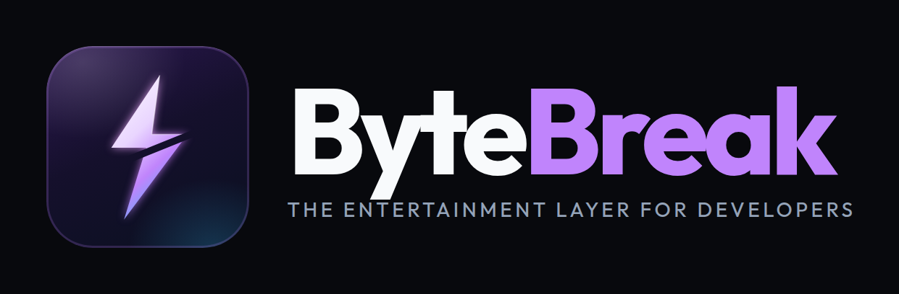

# ByteBreak

<p align="center">
  
</p>

**The entertainment layer for developers.**

> Steam + Discord + Chess.com — for software engineers.

Whenever you’re waiting — AI rate limits, installs, long builds — ByteBreak turns downtime into short competitive engineering games. Stay in the terminal. No browser required.

```bash
npm install -g bytebreak
bytebreak
```

or

```bash
npx bytebreak
```

**That starts a game.** First run auto-detects your environment, starts a silent daemon, installs shell hooks, and drops you into play. No IDE extension. No API keys. No manual config.

**Current release:** `0.1.5` on [npm](https://www.npmjs.com/package/bytebreak) · [source](https://github.com/shaheeramjad/bytebreak)

---

## What it is (v0.1.4)

| Included | Not in this version |
|----------|---------------------|
| Installable CLI + background daemon | Cloud auth / OAuth |
| Offline solo games + local XP / streaks / titles | Multiplayer / tournaments |
| Auto-suggest on real waits (terminal tip + optional desktop notify) | Native overlay app / IDE plugin |
| Generic **“Your AI agent”** messaging (Grok, Claude, Codex, …) | Web dashboard / API server |
| 5 engineering games | Online leaderboards |
| Plugin SDK (in monorepo) | Loading third-party plugins from disk |

---

## Install

### From npm

```bash
# Prefer a user prefix if you get EACCES (do not use sudo)
mkdir -p ~/.local
npm config set prefix ~/.local
export PATH="$HOME/.local/bin:$PATH"

npm install -g bytebreak
bytebreak
```

### Permission error (`EACCES`)

```bash
npm config set prefix ~/.local
export PATH="$HOME/.local/bin:$PATH"
echo 'export PATH="$HOME/.local/bin:$PATH"' >> ~/.bashrc
source ~/.bashrc
npm install -g bytebreak
```

---

## Vibe-coding flow

```text
AI agent rate-limits / long install / long shell command
    → daemon detects a high-signal wait
    → tip on your next terminal prompt (desktop notify only for real limits)
    → you run: bytebreak
    → 90-second game → XP → back to coding
```

Tips use a **generic** label for any agent:

```text
  ⚡ ByteBreak
  Your AI agent is sleeping 😴
  Rate limit or wait — ready for a 90-second battle?
  → run bytebreak for a 90s battle
```

**Manual signal** (works for Grok, Claude, Codex, Cursor, Gemini, …):

```bash
bytebreak limit
# optional custom label:
bytebreak limit --source "Grok"
```

### What does *not* auto-suggest

| Situation | Why |
|-----------|-----|
| Cursor / VS Code simply open | Always-on IDEs are ignored (prevents spam) |
| Agent “thinking” for a long time | No tip on ambient `AI_WAITING` |
| Inside IDE chat UI (no shell) | Tips appear in the **terminal**, not chat panels |

### Quiet controls

```bash
bytebreak settings --set desktopNotify=false
bytebreak settings --set suggestionsEnabled=false
bytebreak settings --set cooldownSec=300
```

---

## Games

| ID | Name | Idea |
|----|------|------|
| `bug-blitz` | Bug Blitz | Find the bug |
| `output-rush` | Output Rush | Guess the output |
| `sql-sprint` | SQL Sprint | Optimize the query |
| `docker-dash` | Docker Dash | Fix the Dockerfile |
| `git-arena` | Git Arena | Resolve the merge conflict |

Languages (varies by game): JavaScript, TypeScript, Python, Go, Rust, Java, C#, SQL, Docker, YAML.

---

## CLI reference

```bash
bytebreak                      # first-run setup if needed → play
bytebreak -g bug-blitz         # pick a game
bytebreak -l python            # puzzle language
bytebreak -d 90                # duration (seconds)
bytebreak -r                   # random game
bytebreak play [gameId]        # same as bare play options
bytebreak games                # list games
bytebreak limit                # signal AI limit → post tip
bytebreak status               # daemon status
bytebreak doctor               # environment diagnosis
bytebreak settings             # view config
bytebreak settings --set k=v   # update config
bytebreak plugins              # detectors + games
bytebreak hooks install        # reinstall shell hooks
bytebreak hooks uninstall
bytebreak stop                 # stop daemon
bytebreak version
bytebreak login / logout       # reserved (cloud not shipped)
```

---

## XP & titles (local)

XP is stored offline under `~/.bytebreak/`.

Titles: Intern → Junior → Mid → Senior → Staff → Principal → Architect → Legend  

Streaks update when you play on consecutive days.

---

## Privacy

- Source code is **never** collected or uploaded  
- Play anonymously by default  
- Shell hooks send **command basenames only** (no argv / secrets)  
- Detectors may look at process **names** and marker file **presence** only  

---

## Develop from source

```bash
# Node 20+, pnpm 9+
git clone https://github.com/shaheeramjad/bytebreak.git && cd bytebreak
pnpm install
pnpm build
pnpm install:global    # bundle + npm install -g to ~/.local

bytebreak version
pnpm test
pnpm smoke
```

### Monorepo layout

```text
packages/
  bytebreak/      # npm package (bundled CLI + daemon)
  runtime/        # CLI, hooks, play, limit
  daemon/         # background process + IPC + suggestions
  event-engine/   # wait detectors
  game-engine/    # session host
  local-store/    # offline XP, history, suggest file
  plugin-sdk/     # defineGame / defineEventDetector
  shared/         # types + IPC protocol
games/
  bug-blitz/ output-rush/ sql-sprint/ docker-dash/ git-arena/
docs/             # architecture, guides, SDK
scripts/          # install-global, smoke
```

### Docs

| Doc | Topic |
|-----|--------|
| [docs/guides/development.md](docs/guides/development.md) | Build, test, publish |
| [docs/guides/testing.md](docs/guides/testing.md) | End-user & smoke test steps |
| [docs/guides/suggestions.md](docs/guides/suggestions.md) | Auto-suggest behavior |
| [docs/architecture/overview.md](docs/architecture/overview.md) | System diagram |
| [docs/architecture/runtime.md](docs/architecture/runtime.md) | CLI architecture |
| [docs/architecture/daemon.md](docs/architecture/daemon.md) | Daemon architecture |
| [docs/sdk/plugin-sdk.md](docs/sdk/plugin-sdk.md) | Plugin contracts |

---

## Publish (maintainers)

npm does **not** allow re-publishing the same version. Bump first.

```bash
pnpm install && pnpm build
pnpm --filter bytebreak build
cd packages/bytebreak
# ensure package.json version is new (e.g. 0.1.5)
npm publish --access public
# with 2FA:
npm publish --access public --otp=XXXXXX
```

---

## License

MIT
